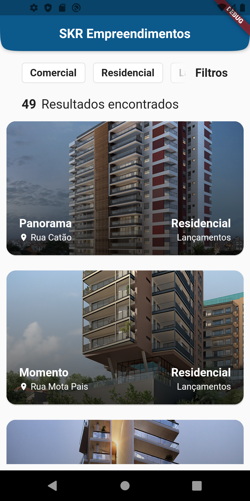
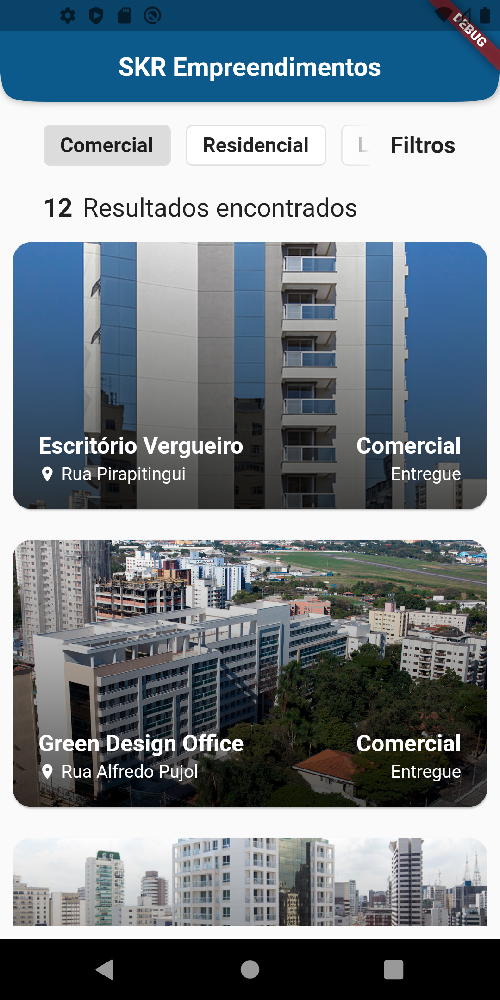
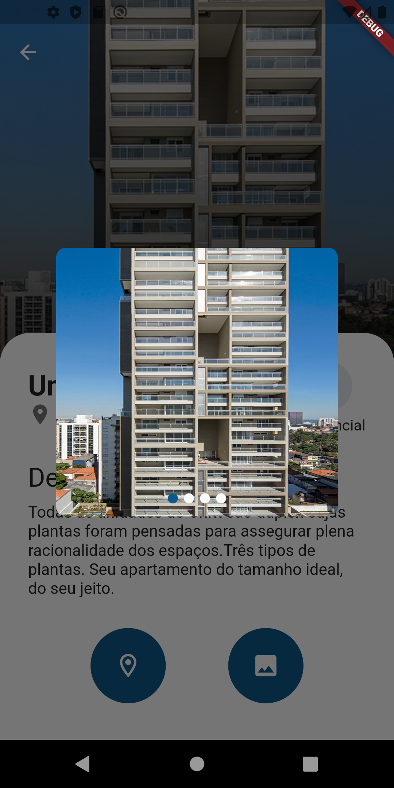

# App de Empreendimentos SKR

Desafio de Desenvolvimento para a vaga de Desenvolvedor Mobile

## Sobre

O projeto é divido em dois arquivos principais, um backend escrito em NodeJS com banco em MySQL que serve uma API REST e um App em Flutter que consome e apresenta os dados.


## Requisitos 

* Node 8
* Git
* Flutter 1.22
* Dart
* Xampp/Lampp


## Instalação

**Passo 1:**

Clonando o repositório e dependências:

```bash
git clone https://github.com/renatoAkino/SKR
```

**Passo 2:**

Criando e populando o banco de dados:

* Inicialize o XAMPP

* Abra o painel do PhpMyAdmin em: [http://localhost/phpmyadmin/](http://localhost/phpmyadmin/) 

* Crie uma nova base de dados com o nome: ```skr```

* Popule o banco criado importando o arquivo ```database.SQL```  localizado na pasta ```/database``` do projeto

**Passo 3:**

Rodando o servidor

```bash
cd server
```

```bash
npm install
```

```bash
node server.js
```

O projeto deve rodar em: [http://localhost:3000](http://localhost:3000) 

**Passo 4:**

Abra o local do App

```bash
cd ..
cd app_skr
```

**Passo 5:**

Instale as bibliotecas e dependências do aplicativo: 

```bash
flutter pub get
```

Abra o emulador através do Android Studio ou VSCode e execute:

```bash
flutter run
```

## Funcionalidades:

* Home
* Tela de detalhes

### Bibliotecas

  flutter_swiper: ^1.1.6
  transparent_image: ^2.0.0
  http: ^0.13.1
  flutter_staggered_grid_view: ^0.4.0
  geocoding: ^2.0.0
  maps_launcher: ^2.0.0

### Estrutura de Pastas
Aqui está a estrutura de pasta principal do flutter:

```
flutter-app/
|- android
|- build
|- ios
|- lib
|- test
```

A arquitetura seguinte foi utilizada nesse projeto:

```
lib/
|- controller/
|- models/
|- pages/
|- repository/
|- main.dart
```

Uma breve explicação sobre cada uma delas:

```
controller/
    Os arquivos contidos aqui são responsáveis pelo gerenciamento e comunicação entre as pages e o repository; 
models/
    Aqui estão os modelos abstratos (classes) que representarão os objetos recebidos;
pages/
    Contém as telas e widgets, em resumo toda UI;
repository/
    Responsável pelos métodos de comunicação http com o servidor;
main.dart 
    Arquivo principal da aplicação;
```

## Telas:

<table>
  <tr>
    <td></td>
    <td></td>
  </tr>
  <tr>
    <td></td>
    <td></td>
  </tr>
 </table>
